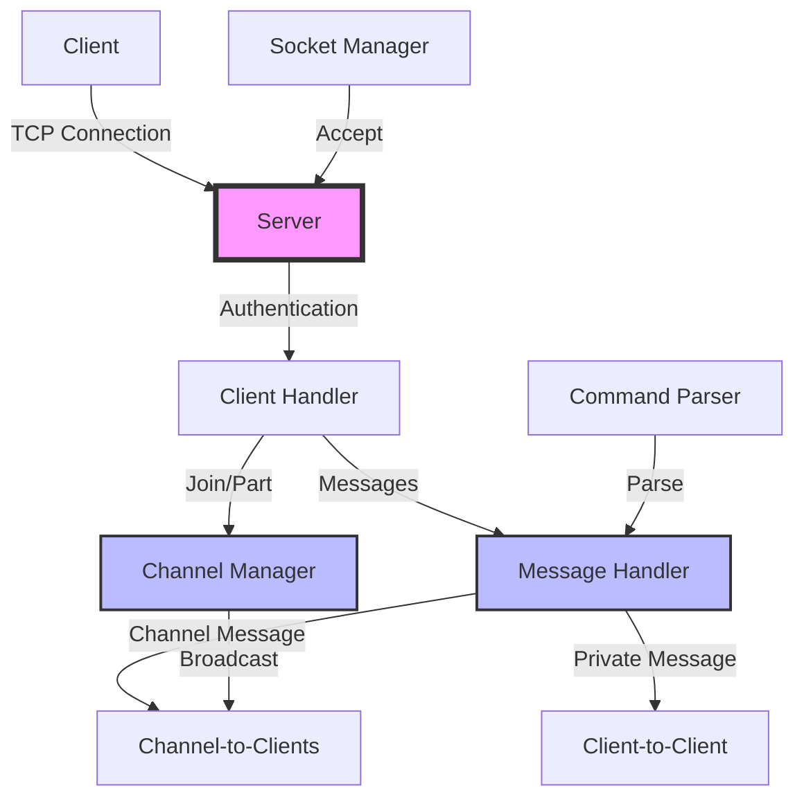

# ft_irc - IRC Server Implementation

A lightweight Internet Relay Chat (IRC) server implementation written in C++98, following the IRC protocol specifications. This project is part of the 42 school curriculum, challenging students to create a basic IRC server that implements the IRC protocol.

## 📑 Table of Contents
- [Architecture Overview](#architecture-overview)
- [Features](#features)
- [Requirements](#requirements)
- [Building](#building)
- [Usage](#usage)
- [Project Structure](#project-structure)
- [Testing](#testing)
- [Cleaning](#cleaning)
- [License](#license)
- [Helpful Resources](#helpful-resources)
  - [IRC Protocol Documentation](#irc-protocol-documentation)
  - [Socket Programming Resources](#socket-programming-resources)
  - [IRC Command Reference](#irc-command-reference)
  - [Implementation Tips](#implementation-tips)

## Architecture Overview



## Features

- Standard IRC server functionality
- Channel management
- Client-to-client communication
- Channel operations (join, leave, messaging)
- User authentication
- Compliant with C++98 standards

## Requirements

- C++ compiler with C++98 support
- Make
- Linux/Unix-based system

## Building

To build the IRC server, simply run:

```bash
make
```

This will create the executable `ircserv` in the root directory.

For development with debug symbols and sanitizers:
- Address Sanitizer
- Leak Sanitizer
- Undefined Behavior Sanitizer

are already configured in the Makefile.

## Usage

To start the server:

```bash
./ircserv <port> <password>
```

Where:
- `<port>`: The port number on which the server will listen
- `<password>`: The connection password for the server

## Project Structure

- `src/Server.cpp/hpp`: Core server implementation
- `src/Client.cpp/hpp`: Client handling and management
- `src/Channel.cpp/hpp`: Channel operations and management
- `src/server_commands.cpp`: IRC command implementations
- `src/main.cpp`: Entry point and server initialization

## Testing

You can connect to the server using any standard IRC client. Some recommended clients:
- irssi
- WeeChat
- HexChat

## Cleaning

- `make clean`: Remove object files
- `make fclean`: Remove object files and executable
- `make re`: Rebuild the project

## License

This project is licensed under the MIT License - see the [LICENSE](LICENSE) file for details.

## Helpful Resources

### IRC Protocol Documentation
- [RFC 1459](https://datatracker.ietf.org/doc/html/rfc1459) - Internet Relay Chat Protocol (Original)
- [RFC 2810](https://datatracker.ietf.org/doc/html/rfc2810) - Internet Relay Chat: Architecture
- [RFC 2811](https://datatracker.ietf.org/doc/html/rfc2811) - Internet Relay Chat: Channel Management
- [RFC 2812](https://datatracker.ietf.org/doc/html/rfc2812) - Internet Relay Chat: Client Protocol
- [RFC 2813](https://datatracker.ietf.org/doc/html/rfc2813) - Internet Relay Chat: Server Protocol

### Socket Programming Resources
- [Beej's Guide to Network Programming](https://beej.us/guide/bgnet/) - Essential guide for socket programming
- [Linux Manual: poll(2)](https://man7.org/linux/man-pages/man2/poll.2.html) - Documentation for poll()
- [Linux Manual: socket(2)](https://man7.org/linux/man-pages/man2/socket.2.html) - Documentation for socket operations
- [ft_irc Guide on Medium](https://medium.com/@afatir.ahmedfatir/small-irc-server-ft-irc-42-network-7cee848de6f9) - Detailed guide for implementing ft_irc project

### IRC Command Reference
Common IRC commands implemented in this project:
- `/nick <nickname>` - Set or change nickname
- `/join #<channel>` - Join a channel
- `/privmsg <target> <message>` - Send message to user or channel
- `/part #<channel>` - Leave a channel
- `/quit [message]` - Disconnect from server
- `/kick #<channel> <nickname>` - Remove user from channel
- `/mode #<channel> <modes> [args]` - Set channel modes

### Implementation Tips
1. Start with basic socket communication
2. Implement user authentication first
3. Add basic command parsing
4. Implement channels one feature at a time
5. Test extensively with different IRC clients
6. Use poll() for handling multiple clients
7. Remember to handle partial messages correctly

<!-- ## Authors

- @pix3l-p33p3r -->

