<div align="center">
  <h1 style="color: #0366d6;">🐋 Inception : Containerized LEMP Stack</h1>
  <p>
    
    
    
    
    
    
  </p>
  <p>A production-grade containerized infrastructure implementing LEMP stack with advanced security and performance optimizations</p>
</div>

## 📑 Table of Contents

<div align="center">
  
</div>

1. [🎯 Project Overview](#-project-overview)
   - [Core Infrastructure](#core-infrastructure)
   - [Project Structure](#project-structure)
   - [Key Components](#key-components)
     - [Advanced NGINX Configuration](#advanced-nginx-configuration)
     - [Database Optimization](#database-optimization)
   - [Performance Features](#performance-features)
     - [Caching Implementation](#caching-implementation)
     - [Resource Management](#resource-management)

2. [🚀 Bonus Features](#-bonus-features)
   - [1. Redis Cache Integration](#1-redis-cache-integration)
   - [2. FTP Server (vsftpd)](#2-ftp-server-vsftpd)
   - [3. Static Website + Portfolio](#3-static-website--portfolio)
   - [4. Adminer Integration](#4-adminer-integration)
   - [5. Monitoring Solution (cAdvisor)](#5-monitoring-solution-cadvisor)

3. [🛠 Build Automation](#-build-automation)
   - [Makefile Targets](#makefile-targets)
   - [Key Features](#key-features)

4. [💡 Implementation Highlights](#-implementation-highlights)

5. [🔒 Security Features](#-security-features)

6. [⚡ Performance Optimizations](#-performance-optimizations)

7. [🔄 Reliability & Maintainability](#-reliability--maintainability)

8. [🔍 Key Features](#-key-features-1)

9. [🔄 PHP Request Processing](#-php-request-processing)

10. [📝 To-Do Features](#-to-do-features)
    - [Monitoring Improvements](#monitoring-improvements)
    - [Security Additions](#security-additions)

---

## 🎯 Project Overview

<div align="center">
  
</div>

This project implements an enterprise-grade web infrastructure featuring a secure LEMP stack (Linux, NGINX, MariaDB, PHP) with WordPress core, extended with Redis caching, FTPS file management, and database administration capabilities. Built with Docker and Docker Compose, the architecture combines a TLS-secured reverse proxy, PHP-FPM application server, and relational database with

<div align="center">
  
</div> additional services for performance optimization, content delivery, and system monitoring - all containerized with strict network segmentation and persistent storage.


### Core Infrastructure

```mermaid
%%{init: {'theme': 'base', 'themeVariables': { 'primaryColor': '#e6f3ff'}}}%%
graph TB
    subgraph Docker Host
        subgraph Docker_Network[Inception Network]
            direction TB
            
            %% Core Services
            NGNIX["NGINX Container
            (TLS 1.2/1.3)
            Port: 443"]
            WORDPRESS["WordPress Container
            (PHP-FPM)
            Port: 9000"]
            MARIADB["MariaDB Container
            Port: 3306"]
            
            %% Bonus Services
            REDIS["Redis Container
            (Cache)
            Port: 6379"]
            FTP["FTP Container
            (vsftpd)
            Port: 21"]
            ADMINER["Adminer Container
            Port: 8080"]
            STATIC["Static Site
            Port: 80"]
            CUSTOM["Custom Service
            (Monitoring)"]
        end

        %% Volumes
        VOL_WP["📁 WordPress Volume
        /home/login/data/wordpress"]
        VOL_DB["🗃️ Database Volume
        /home/login/data/mariadb"]
        VOL_REDIS["📦 Redis Volume
        /home/login/data/redis"]
        CERTS["🔐 TLS Certificates
        /srcs/requirements/nginx/certs"]
    end

    CLIENT[("🌐 Client
    login.42.fr")]
    ADMIN[("🔧 Admin User")]

    %% Core Connections
    CLIENT -->|HTTPS| NGNIX
    NGNIX -->|PHP| WORDPRESS
    WORDPRESS -->|DB Queries| MARIADB
    
    %% Bonus Connections
    WORDPRESS -->|Cache| REDIS
    FTP -->|File Access| VOL_WP
    ADMIN -->|FTP| FTP
    ADMIN -->|DB Mgmt| ADMINER
    ADMINER --> MARIADB
    NGNIX -->|Static Content| STATIC
    CUSTOM -.->|Monitoring| NGNIX
    CUSTOM -.->|Monitoring| WORDPRESS
    CUSTOM -.->|Monitoring| MARIADB

    %% Volume Attachments
    WORDPRESS -.-> VOL_WP
    MARIADB -.-> VOL_DB
    REDIS -.-> VOL_REDIS
    NGNIX -.-> CERTS

    classDef core fill:#e1f5fe,stroke:#039be5;
    classDef bonus fill:#f0f4c3,stroke:#c0ca33;
    classDef volume fill:#e8f5e9,stroke:#43a047;
    classDef certs fill:#fff3e0,stroke:#ffa726;
    classDef client fill:#fce4ec,stroke:#f06292;
    
    class NGNIX,WORDPRESS,MARIADB core;
    class REDIS,FTP,ADMINER,STATIC,CUSTOM bonus;
    class VOL_WP,VOL_DB,VOL_REDIS volume;
    class CERTS certs;
    class CLIENT,ADMIN client;
```



## Project Structure

```plaintext
.
├── Makefile
└── srcs/
    ├── docker-compose.yml
    ├── .env
    └── requirements/
        ├── bonus/
        │   ├── adminer/
        │   │   ├── conf/
        │   │   ├── Dockerfile
        │   │   └── tools/
        │   ├── ftp/
        │   │   ├── conf/
        │   │   ├── Dockerfile
        │   │   └── tools/
        │   ├── redis/
        │   │   ├── conf/
        │   │   ├── Dockerfile
        │   │   └── tools/
        │   ├── static-site/
        │   │   ├── conf/
        │   │   ├── Dockerfile
        │   │   └── tools/
        │   └── custom-service/
        │       ├── conf/
        │       ├── Dockerfile
        │       └── tools/
        ├── mariadb/
        │   ├── conf/
        │   ├── Dockerfile
        │   └── tools/
        ├── nginx/
        │   ├── certs/
        │   ├── conf/
        │   ├── Dockerfile
        │   └── tools/
        └── wordpress/
            ├── conf/
            ├── Dockerfile
            └── tools/
```
### Key Components

#### Advanced NGINX Configuration
```nginx
# NGINX configuration showcasing security and performance optimization
server {
    listen 443 ssl http2;
    server_name your_domain.42.fr;
    
    # TLS Configuration
    ssl_protocols TLSv1.2 TLSv1.3;
    ssl_prefer_server_ciphers off;
    ssl_ciphers ECDHE-ECDSA-AES128-GCM-SHA256:ECDHE-RSA-AES128-GCM-SHA256;
    
    # Security Headers
    add_header Strict-Transport-Security "max-age=31536000; includeSubDomains" always;
    add_header X-Content-Type-Options nosniff;
    add_header X-Frame-Options SAMEORIGIN;
    add_header X-XSS-Protection "1; mode=block";
    
    # Performance Optimization
    location ~* \.(jpg|jpeg|gif|png|css|js|ico|xml)$ {
        expires 30d;
        add_header Cache-Control "public, no-transform";
    }
    
    # PHP-FPM Configuration
    location ~ \.php$ {
        fastcgi_pass wordpress:9000;
        fastcgi_buffer_size 32k;
        fastcgi_buffers 16 16k;
    }
}
```


#### Database Optimization
MariaDB configuration tuned for WordPress performance:

```ini
[mysqld]
innodb_buffer_pool_size = 256M
innodb_log_file_size = 64M
innodb_flush_log_at_trx_commit = 2
innodb_flush_method = O_DIRECT
query_cache_type = 1
query_cache_size = 64M
```

### Performance Features

#### Caching Implementation
- Redis object caching for WordPress
- NGINX FastCGI caching
- Browser caching with optimal headers
- Static file compression

#### Resource Management
- Docker container resource limits
- Volume mount optimization
- Image size optimization
- Automatic container recovery


## 🚀 Bonus Features

### 1. Redis Cache Integration
<div align="center">
  
</div>

#### Implementation Details:
- **Object Caching Configuration**
  ```php
  define('WP_REDIS_HOST', getenv('REDIS_HOST'));
  define('WP_REDIS_PORT', getenv('REDIS_PORT'));
  define('WP_CACHE', true);
  ```
- **Cache Management**
  - Session handling
  - Transient storage optimization
  - Automatic cache invalidation
  - Persistent object caching

#### Performance Metrics:
- 🚀 Up to 5x faster page loads
- 📉 Reduced database load by 80%
- 💾 Optimized memory usage
- ⚡ Improved concurrent user handling

### 2. FTP Server (vsftpd)
#### Secure Configuration:
```nginx
# vsftpd.conf
ssl_enable=YES
allow_anon_ssl=NO
force_local_data_ssl=YES
force_local_logins_ssl=YES
ssl_tlsv1_2=YES
ssl_sslv3=NO
require_ssl_reuse=NO
```

#### Docker Implementation:
```yaml
ftp:
  build: ./requirements/bonus/ftp
  volumes:
    - wordpress_data:/var/www/html
  environment:
    - FTP_USER=${FTP_USER}
    - FTP_PASS=${FTP_PASSWD}
    - FTP_GROUP=${FTP_GROUP}
  ports:
    - "21:21"
    - "20:20"
    - "21100-21110:21100-21110"
  networks:
    - inception_network
```

### 3. Static Website + Portfolio
#### React-based Implementation:
```nginx
# NGINX configuration for static site
location /portfolio {
    root /var/www/html;
    try_files $uri $uri/ /index.html;
    expires 30d;
    add_header Cache-Control "public, no-transform";
    
    # Security headers
    add_header X-Frame-Options "SAMEORIGIN";
    add_header X-XSS-Protection "1; mode=block";
    add_header X-Content-Type-Options "nosniff";
}
```

#### Features:
- 🎨 Modern UI/UX design
- 📱 Responsive layout
- 🔄 CI/CD integration
- 🔒 Security hardening

### 4. Adminer Integration
#### Enhanced Security Setup:
```yaml
adminer:
  build: ./requirements/bonus/adminer
  depends_on:
    - mariadb
  environment:
    - ADMINER_DEFAULT_SERVER=mariadb
    - ADMINER_DESIGN=pepa-linha
    - ADMINER_PLUGINS=tables-filter tinymce
  networks:
    - inception_network
  labels:
    - "traefik.enable=true"
    - "traefik.http.routers.adminer.rule=Host(`adminer.${DOMAIN_NAME}`)"
    - "traefik.http.routers.adminer.tls=true"
```

#### Features:
- 🔐 SSL/TLS encryption
- 🎨 Custom theme integration
- 🔍 Advanced search capabilities
- 📊 Table filtering
- 📝 Rich text editor support

### 5. Monitoring Solution (cAdvisor)
#### Container Monitoring:
```yaml
cadvisor:
  image: gcr.io/cadvisor/cadvisor:latest
  volumes:
    - /:/rootfs:ro
    - /var/run:/var/run:rw
    - /sys:/sys:ro
    - /var/lib/docker/:/var/lib/docker:ro
  ports:
    - "8080:8080"
  networks:
    - inception_network
```

#### Monitoring Features:
- 📊 Real-time container metrics
- 📈 Resource usage statistics
- 🔍 Container performance analysis
- 💾 Storage utilization tracking
- 🌡️ System load monitoring

#### Default Metrics:
- CPU Usage & Throttling
- Memory Usage & Cache
- Network IO
- Filesystem Usage
- Container Lifecycle Events


The implementation showcases both technical expertise and practical knowledge of modern infrastructure practices, making it a production-ready solution.

<style>
h1 { color: #0366d6; }
h2 { color: #24292e; border-bottom: 1px solid #eaecef; padding-bottom: 0.3em; }
.achievement { background-color: #f6f8fa; padding: 15px; border-radius: 5px; margin: 10px 0; }
.metric { background-color: #fff3cd; padding: 15px; border-radius: 5px; margin: 10px 0; }
.learning { background-color: #d4edda; padding: 15px; border-radius: 5px; margin: 10px 0; }
</style>


## 🛠 Build Automation

### Makefile Targets

The project includes comprehensive build automation through Make:

```makefile
# Core commands
all:           # Initialize directories and start services
build:         # Build all Docker images
up:           # Start all services
down:         # Stop all services
stop:         # Stop containers
logs:         # View container logs

# Cleanup commands
clean:        # Stop and remove containers
fclean:       # Full cleanup (containers, volumes, images)
re:           # Complete rebuild (fclean + all)
```

### Key Features

- Automatic directory creation for data persistence
- Container lifecycle management
- Volume and image cleanup
- Colored output for better visibility
- Error handling for cleanup operations

## 💡 Implementation Highlights

## 🔒 Security Features

<div align="center">
  
</div>

- TLS 1.2/1.3 encryption for all traffic
- ModSecurity WAF integration
- Network segmentation
- Secure environment variable handling
- Regular security updates
- Proper file permissions
- Non-root user containers

### Security
- Environment variable management through .env files
- Network isolation using custom bridge network
- Read-only volume mounts where appropriate
- TLS encryption for NGINX

## ⚡ Performance Optimizations

<div align="center">
  
</div>

- Redis object caching
- PHP-FPM process management
- NGINX FastCGI caching
- MariaDB query optimization
- Static file compression
- Browser caching headers

### Performance
- Redis caching integration
- Resource monitoring with cAdvisor
- Optimized volume mounts
- Efficient cleanup processes

## 🔄 Reliability & Maintainability

<div align="center">
  
</div>

- Automatic container recovery
- Volume persistence
- Health checks
- Resource limits
- Logging configuration
- Monitoring integration

### Reliability
- Automatic container restart policy
- Service dependencies management
- Init process enablement
- Persistent data storage

## 🔍 Key Features

<div align="center">
  
</div>


## 🔄 PHP Request Processing

<div align="center">
  
  <p><em>PHP-FPM request processing flow in the WordPress container</em></p>
</div>


## 📝 To-Do Features

### Monitoring Improvements
- [ ] Grafana dashboard integration
- [ ] Prometheus metrics collection
- [ ] Custom alert rules

### Security Additions
- [-] Web Application Firewall (WAF)
- [-] Rate limiting implementation
<!-- - [ ] Advanced authentication methods -->
<!-- 
### Development Tools
- [ ] Local development environment
- [ ] CI/CD pipeline integration
- [ ] Automated testing framework
 -->